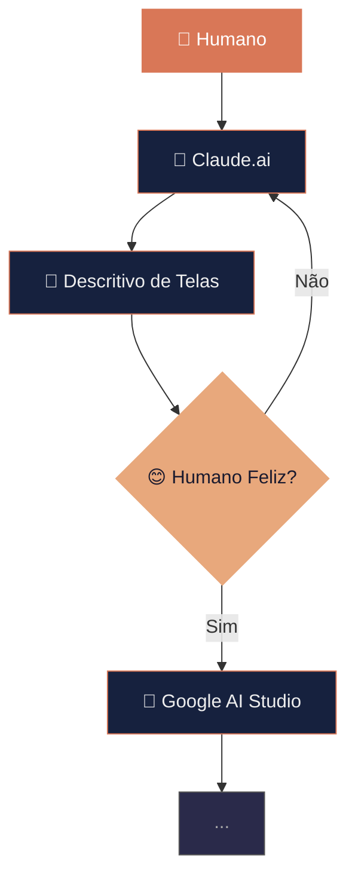

# Curso de Claude Code
## Encontro 2 — Stack Completa de um Projeto

**Pandô APPs**

Entenda cada peça da arquitetura

---

# Revisão — Aula 01

## Como construímos software com IA?

---

# Fluxo de Construção de Software



---

# Agenda

1. Revisão da Aula 01
2. Estrutura de Pastas e Arquitetura
3. Frontend: HTML, CSS, JavaScript
4. Backend: Node.js, Express, API REST
5. Banco de Dados: SQLite e CRUD
6. Integrações: Docker e package.json
7. Vocabulário Técnico
8. Prompts por Camada

---

# O que é uma "Stack"?

**Stack** = Conjunto de tecnologias usadas em um projeto

Nossa stack:
- **Frontend**: HTML + CSS + JavaScript
- **Backend**: Node.js + Express
- **Banco de Dados**: SQLite
- **Infraestrutura**: Docker
- **IA**: Claude Code

---

# Estrutura de Pastas

```
meu-projeto-todo/
├── package.json          # Identidade do projeto
├── docker-compose.yml    # Orquestração
├── server/
│   ├── index.js          # Entrada do backend
│   ├── routes/tasks.js   # Endpoints da API
│   └── database/db.js    # Conexão com banco
├── public/
│   ├── index.html        # Estrutura da página
│   ├── style.css         # Estilos visuais
│   └── app.js            # Lógica do frontend
└── tests/
    └── tasks.test.js     # Testes
```

---

# Separação de Responsabilidades

> Cada módulo tem uma, e apenas uma, razão para mudar.

| Pasta | Responsabilidade |
|---|---|
| `server/` | Lógica do servidor |
| `server/routes/` | Endpoints da API |
| `server/database/` | Persistência de dados |
| `public/` | Interface do usuário |
| `tests/` | Qualidade |

---

# Frontend — Os 3 Pilares

| Tecnologia | Papel | Analogia |
|---|---|---|
| **HTML** | Estrutura | Esqueleto |
| **CSS** | Aparência | Roupa / Maquiagem |
| **JavaScript** | Comportamento | Cérebro |

Juntos, formam tudo que o usuário vê no navegador.

---

# Frontend — Comunicação com Backend

```javascript
// Buscar todas as tarefas
const response = await fetch('/api/tasks');
const tasks = await response.json();

// Criar nova tarefa
await fetch('/api/tasks', {
  method: 'POST',
  headers: { 'Content-Type': 'application/json' },
  body: JSON.stringify({ title: 'Nova tarefa' })
});
```

**Fetch API** = ponte entre frontend e backend

---

# Backend — Express.js

```javascript
const express = require('express');
const app = express();

app.use(express.json());        // Middleware: parse JSON
app.use(express.static('public')); // Servir frontend

app.use('/api/tasks', taskRoutes); // Rotas da API

app.listen(3000, () => {
  console.log('Servidor rodando na porta 3000');
});
```

---

# API REST — Verbos HTTP

| Verbo | Ação | Endpoint | Exemplo |
|---|---|---|---|
| `GET` | Ler | `/api/tasks` | Listar tarefas |
| `POST` | Criar | `/api/tasks` | Nova tarefa |
| `PUT` | Atualizar | `/api/tasks/1` | Editar tarefa 1 |
| `DELETE` | Deletar | `/api/tasks/1` | Remover tarefa 1 |

**Status Codes**: 200 OK, 201 Created, 400 Bad Request, 404 Not Found, 500 Error

---

# Banco de Dados — SQLite

```sql
CREATE TABLE tasks (
    id INTEGER PRIMARY KEY AUTOINCREMENT,
    title TEXT NOT NULL,
    completed BOOLEAN DEFAULT 0,
    created_at DATETIME DEFAULT CURRENT_TIMESTAMP
);
```

**CRUD** = as 4 operações fundamentais:
- **C**reate → `INSERT INTO`
- **R**ead → `SELECT`
- **U**pdate → `UPDATE`
- **D**elete → `DELETE`

---

# Fluxo Completo: Criar Tarefa

```
Usuário clica "Adicionar"
    ↓
JavaScript captura o evento
    ↓
Fetch API → POST /api/tasks
    ↓
Express recebe → Middleware processa
    ↓
Rota encontrada → Controller executa
    ↓
INSERT INTO tasks → Banco retorna ID
    ↓
Resposta 201 → JavaScript atualiza DOM
    ↓
Tarefa aparece na tela
```

---

# Mapa Visual da Stack

```
┌─────────── NAVEGADOR ───────────┐
│  HTML + CSS + JavaScript        │
│  (public/)                      │
└──────────────┬──────────────────┘
               │ HTTP (Fetch API)
┌──────────────┴──────────────────┐
│         SERVIDOR                 │
│  Express → Rotas → Controllers  │
│  (server/)                      │
└──────────────┬──────────────────┘
               │ SQL
┌──────────────┴──────────────────┐
│      BANCO DE DADOS              │
│  SQLite (database.sqlite)        │
└─────────────────────────────────┘
```

---

# Docker — Por que usar?

- **Isolamento**: Cada serviço roda em seu container
- **Reprodutibilidade**: "Funciona na minha máquina" → funciona em todas
- **Simplicidade**: `docker-compose up` roda tudo

```yaml
services:
  app:
    build: .
    ports:
      - "3000:3000"
```

---

# Lendo Código Gerado por IA

### Estratégia:
1. Comece pelo **ponto de entrada** (`index.js`)
2. Siga o **fluxo de dados**
3. Identifique os **padrões** (rotas, controllers, models)
4. Leia os **imports**
5. Teste mentalmente

### Sinais de alerta:
- Credenciais hardcoded
- Falta de validação
- Console.log em produção
- Dependências não usadas

---

# Vocabulário — Top 20

| Termo | Definição |
|---|---|
| Stack | Conjunto de tecnologias |
| API | Interface de comunicação |
| REST | Padrão de API web |
| Endpoint | URL específica da API |
| Middleware | Função intermediária |
| CRUD | Create, Read, Update, Delete |
| Schema | Estrutura do banco |
| Container | Ambiente isolado (Docker) |
| DOM | Representação da página HTML |
| Deploy | Publicação em produção |

---

# Prompts por Camada

**Frontend:**
```
explique como HTML, CSS e JS se conectam nesta página
```

**Backend:**
```
liste todos os endpoints com verbos HTTP e parâmetros
```

**Banco:**
```
mostre o schema com todas as tabelas e colunas
```

**Infra:**
```
explique o docker-compose.yml linha por linha
```

---

# Atividade Prática

1. Use o Claude para mapear **todos os arquivos** do projeto
2. Para cada arquivo, peça: "o que este arquivo faz?"
3. Trace o fluxo de uma requisição completa
4. Monte seu próprio glossário com os termos novos
5. Catalogue 3 prompts úteis por camada

---

# Checklist de Entregáveis

- [ ] Mapa visual da stack documentado
- [ ] Glossário com 30+ termos técnicos
- [ ] Documentação da arquitetura
- [ ] Prompts catalogados por camada
- [ ] Consegue explicar o fluxo de uma requisição

---

# Próximo Encontro

## Aula 03 — Fluxo de Equipe, Git e Segurança

- Versionamento com Git
- Branches, commits, merge
- Segurança: .env, credenciais
- Fluxo de trabalho em equipe

**Tarefa**: explore o projeto com o Claude e documente 5 termos novos que aprendeu!

---

# Obrigado!

**Pandô APPs**

Pergunte ao Claude: `explique [qualquer termo] como se eu fosse iniciante`
