# Aula 02 — Stack Completa de um Projeto

## Curso de Claude Code — Pandô APPs

---

## Sumário

1. [Introdução](#1-introdução)
2. [Revisão do Projeto Exemplo](#2-revisão-do-projeto-exemplo) — Fluxo de construção com IA
3. [Estrutura de Pastas e Decisões de Arquitetura](#3-estrutura-de-pastas-e-decisões-de-arquitetura)
4. [Camada: Frontend](#4-camada-frontend)
5. [Camada: Backend](#5-camada-backend)
6. [Camada: Banco de Dados](#6-camada-banco-de-dados)
7. [Camada: Integrações e Infraestrutura](#7-camada-integrações-e-infraestrutura)
8. [Leitura e Interpretação de Código Gerado por IA](#8-leitura-e-interpretação-de-código-gerado-por-ia)
9. [Glossário de Vocabulário Técnico](#9-glossário-de-vocabulário-técnico)
10. [Prompts Eficazes por Camada](#10-prompts-eficazes-por-camada)
11. [Mapa Visual da Stack](#11-mapa-visual-da-stack)
12. [Checklist de Entregáveis](#12-checklist-de-entregáveis)

---

## 1. Introdução

No primeiro encontro, construímos um projeto do zero. Agora, vamos abrir o capô e entender cada peça. Este encontro é dedicado a **ler, interpretar e nomear** cada componente da stack.

A capacidade de comunicar com precisão o que cada parte do sistema faz é fundamental para:
- Trabalhar em equipe de forma eficaz
- Dar instruções melhores ao Claude Code
- Depurar problemas com mais agilidade
- Tomar decisões técnicas informadas

---

## 2. Revisão do Projeto Exemplo

### Fluxo Completo de Construção de Software com IA

Antes de mergulhar na stack, veja o processo completo que usamos para construir um software — do humano à entrega:

```mermaid
flowchart LR
    H["👤 Humano"] --> C1["🤖 Claude.ai"]
    C1 --> DT["📄 Descritivo\nde Telas ①"]
    DT --> F1{"😊 Humano\nFeliz?"}
    F1 -- Não --> C1
    F1 -- Sim --> GAS["🎨 Google AI\nStudio"]
    GAS --> T["🖥️ Telas ②"]
    T --> F2{"😊 Humano\nFeliz?"}
    F2 -- Não --> GAS
    F2 -- Sim --> C2["🤖 Claude.ai"]
    C2 --> REQ["📋 Documento de\nRequisitos ③"]
    REQ --> F3{"😊 Humano\nFeliz?"}
    F3 -- Não --> C2
    F3 -- Sim --> S["📊 Slide\nAula 01 ②③"]
    S --> PP["📝 Prompt\ndo Projeto"]
    PP --> CLI["⌨️ Claude CLI"]
    CLI --> PR["📦 Projeto ④"]
    PR --> F4{"😊 Humano\nFeliz?"}
    F4 -- Não --> CLI
    F4 -- Sim --> FIM["🏁 Fim"]
```



> Os números ①②③④ indicam os artefatos gerados em cada etapa que servem de insumo para as próximas.

---

Vamos revisitar a estrutura do projeto To-Do List criado na Aula 01.

### Abrindo o projeto com Claude Code

```bash
cd ~/meu-projeto-todo
claude
```

**Peça ao Claude**:
```
faça uma análise completa da arquitetura deste projeto,
listando todos os arquivos e suas responsabilidades
```

### Estrutura típica gerada

```
meu-projeto-todo/
├── package.json          # Manifesto do projeto (dependências, scripts)
├── docker-compose.yml    # Orquestração de containers
├── Dockerfile            # Instruções para construir a imagem Docker
├── .gitignore            # Arquivos ignorados pelo Git
├── server/
│   ├── index.js          # Ponto de entrada do backend
│   ├── routes/
│   │   └── tasks.js      # Rotas da API de tarefas
│   ├── models/
│   │   └── task.js       # Modelo de dados da tarefa
│   └── database/
│       └── db.js         # Configuração do banco de dados
├── public/
│   ├── index.html        # Página principal
│   ├── style.css         # Estilos visuais
│   └── app.js            # Lógica do frontend
└── tests/
    └── tasks.test.js     # Testes automatizados
```

---

## 3. Estrutura de Pastas e Decisões de Arquitetura

### Por que organizar em pastas?

A organização em pastas reflete **decisões de arquitetura**. Cada pasta agrupa código com uma responsabilidade específica:

| Pasta | Responsabilidade | Conceito |
|---|---|---|
| `server/` | Lógica do servidor | **Backend** |
| `server/routes/` | Definição de endpoints | **Roteamento** |
| `server/models/` | Estrutura dos dados | **Modelagem** |
| `server/database/` | Conexão com banco | **Persistência** |
| `public/` | Arquivos do navegador | **Frontend** |
| `tests/` | Testes automatizados | **Qualidade** |

### Separação de Responsabilidades (Separation of Concerns)

Este é um dos princípios mais importantes da engenharia de software: **cada módulo deve ter uma, e apenas uma, razão para mudar**.

- O frontend muda quando a interface precisa mudar
- As rotas mudam quando a API precisa mudar
- O modelo muda quando a estrutura de dados muda
- O banco muda quando a forma de armazenamento muda

**Prompt para explorar**:
```
quais são as responsabilidades de cada pasta neste projeto?
por que foram organizadas dessa forma?
```

---

## 4. Camada: Frontend

O **frontend** é tudo que o usuário vê e interage no navegador.

### Componentes do Frontend

#### HTML (`public/index.html`)
- **O que é**: Linguagem de marcação que define a **estrutura** da página
- **Analogia**: É o esqueleto da página — define o que existe (botões, formulários, listas)
- **Elementos importantes**: `<form>`, `<input>`, `<button>`, `<ul>`, `<li>`

#### CSS (`public/style.css`)
- **O que é**: Linguagem de estilos que define a **aparência** da página
- **Analogia**: É a roupa e maquiagem — define como as coisas aparecem (cores, tamanhos, posições)
- **Conceitos**: seletores, propriedades, responsividade, flexbox, grid

#### JavaScript (`public/app.js`)
- **O que é**: Linguagem de programação que define o **comportamento** da página
- **Analogia**: É o cérebro — define o que acontece quando o usuário clica, digita, etc.
- **Conceitos**: eventos, DOM, fetch API, async/await

### Comunicação com o Backend

O frontend se comunica com o backend através de **requisições HTTP** usando a **Fetch API**:

```javascript
// Exemplo: buscar todas as tarefas
const response = await fetch('/api/tasks');
const tasks = await response.json();
```

**Vocabulário importante**:
- **DOM** (Document Object Model): representação da página HTML como objetos JavaScript
- **Evento**: ação do usuário (clique, digitação, submit de formulário)
- **Fetch API**: interface para fazer requisições HTTP
- **JSON**: formato de dados usado para trocar informações entre frontend e backend

**Prompts para explorar o frontend**:
```
explique como o frontend se comunica com o backend neste projeto
```
```
o que acontece quando o usuário clica no botão de adicionar tarefa?
descreva passo a passo desde o clique até a tarefa aparecer na tela
```

---

## 5. Camada: Backend

O **backend** é o servidor que processa as requisições e gerencia os dados.

### Componentes do Backend

#### Servidor (`server/index.js`)
- **O que é**: O ponto de entrada da aplicação — inicia o servidor e configura middlewares
- **Express**: Framework web para Node.js que simplifica a criação de servidores HTTP
- **Porta**: Número que identifica o servidor na rede (ex: 3000)

#### Rotas (`server/routes/tasks.js`)
- **O que são**: Mapeamento entre URLs + métodos HTTP e funções que processam as requisições
- **Endpoint**: Um endereço específico da API (ex: `/api/tasks`)

### API REST

REST (Representational State Transfer) é um padrão de como organizar a comunicação entre sistemas. Os **verbos HTTP** indicam a ação:

| Verbo | Ação | Exemplo | Significado |
|---|---|---|---|
| `GET` | Ler | `GET /api/tasks` | Listar todas as tarefas |
| `POST` | Criar | `POST /api/tasks` | Criar nova tarefa |
| `PUT` | Atualizar | `PUT /api/tasks/1` | Atualizar tarefa 1 |
| `DELETE` | Deletar | `DELETE /api/tasks/1` | Deletar tarefa 1 |

### Status Codes HTTP

| Código | Significado | Quando usar |
|---|---|---|
| `200` | OK | Requisição bem-sucedida |
| `201` | Created | Recurso criado com sucesso |
| `400` | Bad Request | Dados inválidos enviados |
| `404` | Not Found | Recurso não encontrado |
| `500` | Internal Server Error | Erro no servidor |

**Vocabulário importante**:
- **Middleware**: Função que intercepta requisições antes de chegarem à rota (ex: autenticação, logging)
- **Controller**: Função que processa a requisição e retorna uma resposta
- **Request (req)**: Objeto com dados da requisição (body, params, query)
- **Response (res)**: Objeto usado para enviar a resposta ao cliente

**Prompts para explorar o backend**:
```
liste todos os endpoints da API e explique o que cada um faz
```
```
como funciona o middleware neste servidor?
```
```
o que acontece quando uma requisição POST chega em /api/tasks?
descreva o fluxo completo
```

---

## 6. Camada: Banco de Dados

O **banco de dados** é onde os dados são armazenados de forma persistente.

### SQLite no Projeto

- **O que é**: Banco de dados relacional leve, armazenado em um único arquivo
- **Vantagem**: Não precisa instalar um servidor de banco separado
- **Arquivo**: Geralmente `database.sqlite` ou `db.sqlite`

### Conceitos Fundamentais

#### Tabela
Estrutura que organiza dados em linhas e colunas (como uma planilha):

```sql
CREATE TABLE tasks (
    id INTEGER PRIMARY KEY AUTOINCREMENT,
    title TEXT NOT NULL,
    completed BOOLEAN DEFAULT 0,
    created_at DATETIME DEFAULT CURRENT_TIMESTAMP
);
```

#### CRUD
As quatro operações básicas de dados:

| Operação | SQL | Significado |
|---|---|---|
| **C**reate | `INSERT INTO tasks (title) VALUES ('Estudar')` | Criar registro |
| **R**ead | `SELECT * FROM tasks` | Ler registros |
| **U**pdate | `UPDATE tasks SET completed = 1 WHERE id = 1` | Atualizar registro |
| **D**elete | `DELETE FROM tasks WHERE id = 1` | Deletar registro |

**Vocabulário importante**:
- **Schema**: Estrutura/definição das tabelas do banco
- **Migration**: Script que altera a estrutura do banco de forma controlada
- **Query**: Consulta ao banco de dados
- **ORM**: Biblioteca que permite interagir com o banco usando objetos (em vez de SQL puro)
- **Chave Primária (Primary Key)**: Identificador único de cada registro
- **INDEX**: Otimização para buscas mais rápidas

**Prompts para explorar o banco**:
```
mostre a estrutura do banco de dados deste projeto
```
```
explique como os dados são salvos quando o usuário cria uma nova tarefa
```
```
quais queries SQL são executadas neste projeto?
```

---

## 7. Camada: Integrações e Infraestrutura

### Docker

- **Container**: Ambiente isolado que empacota a aplicação com todas as suas dependências
- **Imagem**: Template para criar containers (definida no `Dockerfile`)
- **docker-compose.yml**: Arquivo que orquestra múltiplos containers

```yaml
# Exemplo simplificado
services:
  app:
    build: .
    ports:
      - "3000:3000"
    volumes:
      - ./:/app
```

### package.json

O "cartão de identidade" do projeto Node.js:

```json
{
  "name": "meu-projeto-todo",
  "version": "1.0.0",
  "scripts": {
    "start": "node server/index.js",
    "dev": "nodemon server/index.js",
    "test": "jest"
  },
  "dependencies": {
    "express": "^4.18.0",
    "better-sqlite3": "^9.0.0"
  },
  "devDependencies": {
    "nodemon": "^3.0.0",
    "jest": "^29.0.0"
  }
}
```

**Vocabulário importante**:
- **Dependência**: Biblioteca externa que o projeto usa
- **devDependency**: Dependência usada apenas em desenvolvimento
- **Script npm**: Comando personalizado (ex: `npm start`, `npm test`)
- **node_modules/**: Pasta onde as dependências são instaladas
- **Semver** (Versionamento Semântico): Sistema de versão `MAJOR.MINOR.PATCH`

**Prompts para explorar**:
```
explique o docker-compose.yml deste projeto
```
```
quais são as dependências deste projeto e para que cada uma serve?
```

---

## 8. Leitura e Interpretação de Código Gerado por IA

Código gerado por IA precisa ser **lido, entendido e validado**. Nunca aceite código sem entendê-lo.

### Estratégia de Leitura

1. **Comece pelo ponto de entrada**: `server/index.js` ou `app.js`
2. **Siga o fluxo de dados**: De onde os dados vêm? Para onde vão?
3. **Identifique os padrões**: Rotas, controllers, models
4. **Leia os imports**: Quais módulos estão sendo usados?
5. **Teste mentalmente**: "Se eu clicar neste botão, o que acontece?"

### Perguntas que Você Deve Fazer

Para cada arquivo gerado, pergunte:

```
o que este arquivo faz?
```
```
quais funções ele exporta e quem as consome?
```
```
tem algum problema de segurança neste código?
```
```
esse código segue boas práticas? o que poderia melhorar?
```

### Sinais de Alerta em Código Gerado

Fique atento a:
- **Credenciais hardcoded**: Senhas ou chaves de API escritas diretamente no código
- **Falta de validação**: Dados do usuário aceitos sem verificação
- **Console.log em produção**: Logs de debug que não deveriam existir
- **Dependências desnecessárias**: Bibliotecas importadas mas não usadas
- **Código duplicado**: Mesma lógica repetida em vários lugares

---

## 9. Glossário de Vocabulário Técnico

### Termos Gerais

| Termo | Definição |
|---|---|
| **Stack** | Conjunto de tecnologias usadas em um projeto |
| **Full-stack** | Desenvolvimento que abrange frontend e backend |
| **Framework** | Estrutura pronta que facilita o desenvolvimento |
| **Biblioteca (Library)** | Código reutilizável que resolve um problema específico |
| **API** | Interface de Programação de Aplicações — contrato de comunicação entre sistemas |
| **REST** | Padrão de arquitetura para APIs web |
| **JSON** | Formato de dados leve para troca de informações |
| **HTTP/HTTPS** | Protocolo de comunicação da web |

### Termos de Frontend

| Termo | Definição |
|---|---|
| **DOM** | Representação em objetos da página HTML |
| **Responsivo** | Design que se adapta a diferentes tamanhos de tela |
| **SPA** | Single Page Application — aplicação de página única |
| **Evento** | Ação do usuário que dispara código |
| **Render** | Processo de exibir elementos na tela |
| **Layout** | Disposição visual dos elementos na página |

### Termos de Backend

| Termo | Definição |
|---|---|
| **Servidor** | Programa que recebe e responde requisições |
| **Endpoint** | URL específica da API |
| **Rota** | Mapeamento entre URL e função de processamento |
| **Middleware** | Função intermediária no processamento de requisições |
| **Controller** | Função que contém a lógica de processamento |
| **Porta** | Número que identifica um serviço na rede |

### Termos de Banco de Dados

| Termo | Definição |
|---|---|
| **Schema** | Definição da estrutura do banco |
| **Tabela** | Estrutura que organiza dados em linhas e colunas |
| **Query** | Consulta/comando ao banco de dados |
| **CRUD** | Create, Read, Update, Delete — operações básicas |
| **Migration** | Script que altera a estrutura do banco de forma controlada |
| **Seed** | Dados iniciais inseridos no banco para testes |

### Termos de Infraestrutura

| Termo | Definição |
|---|---|
| **Container** | Ambiente isolado para executar aplicações |
| **Imagem Docker** | Template para criar containers |
| **Volume** | Área de armazenamento persistente para containers |
| **Porta mapeada** | Conexão entre porta do host e do container |
| **Build** | Processo de compilar/preparar a aplicação |
| **Deploy** | Publicação da aplicação em um ambiente |

---

## 10. Prompts Eficazes por Camada

### Frontend

```
explique como o HTML, CSS e JavaScript se conectam nesta página
```
```
como a interface reage quando o usuário adiciona uma tarefa?
descreva o fluxo de eventos
```
```
adicione um componente de filtro para mostrar apenas tarefas pendentes
```
```
torne a interface responsiva para funcionar bem em celulares
```

### Backend

```
liste todos os endpoints da API com seus verbos HTTP e parâmetros
```
```
adicione validação no endpoint POST /api/tasks para rejeitar títulos vazios
```
```
adicione um middleware de log que registre todas as requisições recebidas
```
```
crie um endpoint GET /api/tasks/stats que retorne estatísticas
(total de tarefas, concluídas, pendentes)
```

### Banco de Dados

```
mostre o schema do banco de dados com todas as tabelas e colunas
```
```
adicione um campo "priority" na tabela de tarefas com valores
(baixa, média, alta)
```
```
crie um índice para otimizar busca por tarefas não concluídas
```
```
adicione uma tabela de categorias e relacione com as tarefas
```

### Infraestrutura

```
explique o Dockerfile linha por linha
```
```
adicione um container de banco PostgreSQL no docker-compose
```
```
configure um script npm para rodar o projeto em modo de desenvolvimento
com hot-reload
```

---

## 11. Mapa Visual da Stack

```
┌─────────────────────────────────────────────────────────┐
│                      NAVEGADOR                           │
│  ┌──────────┐  ┌──────────┐  ┌──────────────────────┐  │
│  │   HTML    │  │   CSS    │  │    JavaScript        │  │
│  │ Estrutura │  │ Estilos  │  │ Comportamento        │  │
│  │           │  │          │  │                      │  │
│  │ index.html│  │style.css │  │ app.js               │  │
│  └──────────┘  └──────────┘  └───────────┬──────────┘  │
│                                           │              │
│                              Fetch API (HTTP Requests)   │
└──────────────────────────────────┬──────────────────────┘
                                   │
                          Requisições HTTP
                          (GET, POST, PUT, DELETE)
                                   │
┌──────────────────────────────────┴──────────────────────┐
│                      SERVIDOR                            │
│  ┌──────────────────────────────────────────────────┐   │
│  │  Express (index.js)                               │   │
│  │  ┌────────────┐  ┌────────────┐  ┌───────────┐  │   │
│  │  │ Middleware  │→ │   Rotas    │→ │Controllers│  │   │
│  │  │  (logging,  │  │ (tasks.js) │  │ (lógica)  │  │   │
│  │  │  cors, json)│  │            │  │           │  │   │
│  │  └────────────┘  └────────────┘  └─────┬─────┘  │   │
│  └────────────────────────────────────────┼─────────┘   │
│                                            │             │
│  ┌─────────────────────────────────────────┴────────┐   │
│  │  Banco de Dados (SQLite)                          │   │
│  │  ┌────────────┐  ┌────────────┐                  │   │
│  │  │  Modelo     │  │  database   │                  │   │
│  │  │ (task.js)   │  │  (db.js)    │                  │   │
│  │  └────────────┘  └────────────┘                  │   │
│  └──────────────────────────────────────────────────┘   │
└─────────────────────────────────────────────────────────┘

┌─────────────────────────────────────────────────────────┐
│                     DOCKER                               │
│  ┌──────────────────────────────────────────────────┐   │
│  │  docker-compose.yml                               │   │
│  │  Orquestra todos os serviços acima                │   │
│  └──────────────────────────────────────────────────┘   │
└─────────────────────────────────────────────────────────┘
```

### Fluxo de uma Requisição (Exemplo: Criar Tarefa)

```
1. Usuário digita "Estudar Claude Code" e clica em "Adicionar"
   │
2. JavaScript captura o evento de clique
   │
3. Fetch API envia: POST /api/tasks { title: "Estudar Claude Code" }
   │
4. Express recebe a requisição
   │
5. Middleware processa (JSON parse, CORS, logging)
   │
6. Rota /api/tasks com método POST é encontrada
   │
7. Controller executa a lógica de criação
   │
8. Model faz INSERT no SQLite
   │
9. Banco retorna o ID do novo registro
   │
10. Controller envia resposta: 201 { id: 5, title: "Estudar Claude Code" }
    │
11. JavaScript recebe a resposta
    │
12. DOM é atualizado com a nova tarefa na lista
```

---

## 12. Checklist de Entregáveis

- [ ] **Mapa visual da stack** do projeto criado e compreendido
- [ ] **Glossário de vocabulário técnico** revisado (mínimo 30 termos)
- [ ] **Documentação da arquitetura** do projeto exemplo
- [ ] **Prompts catalogados** por camada (frontend, backend, banco, infra)
- [ ] Consegue explicar o fluxo completo de uma requisição
- [ ] Consegue identificar a responsabilidade de cada arquivo
- [ ] Sabe nomear corretamente os componentes da stack

---

## Recursos Adicionais

- **MDN Web Docs** (Frontend): [developer.mozilla.org](https://developer.mozilla.org/pt-BR/)
- **Express.js Docs** (Backend): [expressjs.com](https://expressjs.com/)
- **SQLite Docs** (Banco): [sqlite.org/docs.html](https://sqlite.org/docs.html)
- **Docker Docs**: [docs.docker.com](https://docs.docker.com/)

---

> **Próxima Aula**: No Encontro 3, vamos aprender a trabalhar em equipe com Git, versionamento e práticas de segurança.
