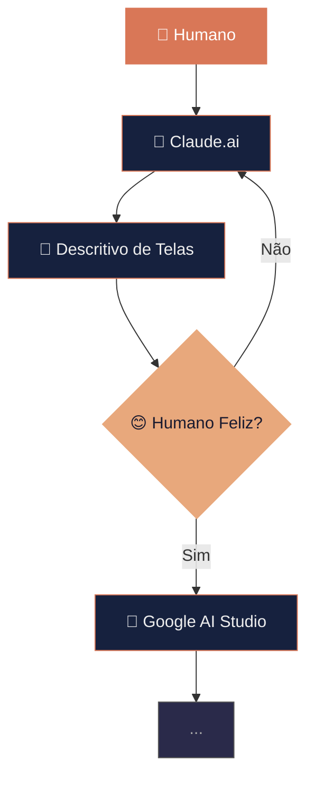

# Curso de Claude Code
## Encontro 3 — Fluxo de Equipe, Git e Segurança

**Pandô APPs**

Colaboração profissional com IA

---

# Revisão — Aula 01

## Como construímos software com IA?

---

# Fluxo de Construção de Software



---

# Agenda

1. Git: O que é e por quê
2. Commits, Staging e Histórico
3. Branches e Trabalho Paralelo
4. Merge e Pull Requests
5. Git com Claude Code
6. Segurança: o que nunca expor
7. Arquivo .env e ambientes
8. Integração com NanoBanana (geração de imagens)
9. Revisão de código IA
10. Fluxo padronizado da equipe

---

# O que é Git?

Sistema de **controle de versão** — rastreia todas as mudanças do projeto.

| Sem Git | Com Git |
|---|---|
| "Qual versão funcionava?" | `git log` |
| "Quem mudou isso?" | `git blame` |
| "Perdi meu código!" | `git checkout` |
| "Vamos editar juntos?" | Branches! |
| "Quebrou tudo!" | `git revert` |

---

# Os 3 Estados do Git

```
Working Directory → Staging Area → Repository
     (edições)        (git add)     (git commit)
```

```bash
git status              # O que mudou?
git add arquivo.js      # Preparar para commit
git commit -m "msg"     # Salvar no histórico
git push                # Enviar para o remoto
```

---

# Anatomia de um Commit

Um commit contém:
- **Hash**: Identificador único (`a1b2c3d`)
- **Mensagem**: Descrição da mudança
- **Autor**: Quem fez
- **Data**: Quando

### Boas mensagens de commit:

```
feat: adiciona filtro de tarefas por prioridade
fix: corrige erro ao salvar tarefa sem título
docs: atualiza README com instruções de setup
```

---

# Regras de Commit

1. **Pequenos e frequentes** (não gigantes)
2. **Uma mudança lógica** por commit
3. **Mensagem descritiva** (tipo: descrição)

| Tipo | Quando |
|---|---|
| `feat` | Nova funcionalidade |
| `fix` | Correção de bug |
| `docs` | Documentação |
| `refactor` | Refatoração |
| `test` | Testes |
| `chore` | Manutenção |

---

# Branches

Branch = cópia independente do código

```
main ─────●─────●─────●─────●──────
                │              ↑
                └──●──●──●────┘
               feature/filtro
```

```bash
git checkout -b feature/filtro     # Criar
git branch                          # Listar
git checkout main                   # Trocar
```

---

# Fluxo com Branches

```bash
# 1. Criar branch
git checkout -b feature/minha-tarefa

# 2. Trabalhar e commitar
git add .
git commit -m "feat: nova funcionalidade"

# 3. Enviar para o remoto
git push -u origin feature/minha-tarefa

# 4. Criar Pull Request no GitHub

# 5. Após revisão, merge na main

# 6. Deletar branch usada
git branch -d feature/minha-tarefa
```

---

# Merge e Conflitos

**Merge** = combinar mudanças de uma branch em outra

**Conflito** = duas pessoas editaram o mesmo trecho

```
<<<<<<< HEAD
código da main
=======
código da feature
>>>>>>> feature/filtro
```

**Solução**: escolher qual versão manter, remover marcadores, commitar.

---

# Pull Request (PR)

Antes do merge, criamos um **Pull Request** para:
- Pedir revisão de código
- Discutir mudanças
- Registrar decisões

```bash
gh pr create --title "feat: filtro de tarefas" \
  --body "Adiciona filtro por status"
```

**Regra**: código só entra na `main` após revisão!

---

# Git com Claude Code

Use **linguagem natural**:

```
quais arquivos foram modificados?        → git status
me mostre o que mudou                    → git diff
faça commit com mensagem descritiva      → git commit
crie branch para funcionalidade X        → git checkout -b
mostre os últimos 5 commits              → git log
ajude a resolver conflitos de merge      → resolve conflicts
```

Comando especial: `/commit` — analisa mudanças e sugere mensagem

---

# Segurança: O que NUNCA expor

| NUNCA no código | Risco |
|---|---|
| Chaves de API (`sk-abc...`) | Acesso não autorizado |
| Senhas de banco | Dados comprometidos |
| Tokens de auth | Roubo de identidade |
| Chaves SSH | Acesso a servidores |
| Dados pessoais (CPF, etc.) | Violação LGPD |

> **Regra de ouro**: se contém credencial, NÃO vai pro Git!

---

# O Arquivo .gitignore

Diz ao Git o que **ignorar**:

```gitignore
# NUNCA commitar!
.env
.env.local
.env.production

# Dependências
node_modules/

# Banco local
*.sqlite

# Logs e sistema
*.log
.DS_Store
```

---

# O Arquivo .env

Armazena **variáveis de ambiente**:

```env
PORT=3000
NODE_ENV=development
DATABASE_URL=sqlite://./database.sqlite

# Chave do NanoBanana (NUNCA commitar!)
NANOBANANA_API_KEY=nb_live_sua-chave-aqui
```

### No código:
```javascript
require('dotenv').config();
const apiKey = process.env.NANOBANANA_API_KEY;
```

---

# Separação de Ambientes

| Arquivo | Ambiente |
|---|---|
| `.env.development` | Desenvolvimento local |
| `.env.test` | Testes automatizados |
| `.env.production` | Produção |

### .env.example (este SIM vai pro Git):
```env
# Copie para .env e preencha
PORT=3000
NODE_ENV=development
DATABASE_URL=
NANOBANANA_API_KEY=
```

---

# NanoBanana — Geração de Imagens com IA

Vamos integrar geração de imagens ao nosso projeto!

### O que é o NanoBanana?
Plataforma de geração de imagens por IA via API REST.

### Por que usar nesta aula?
- Demonstra uso **real** de chave de API no `.env`
- Pratica segurança desde o início
- Resultado visual e imediato

---

# Fluxo da Integração NanoBanana

```
1. Criar conta em nanobanana.io
      ↓
2. Gerar API Key no painel
      ↓
3. Salvar no .env (NUNCA no código!)
      ↓
4. Claude Code escreve a integração
      ↓
5. Revisar o código gerado
      ↓
6. Testar localmente
      ↓
7. Commitar (sem o .env!)
```

---

# Configurando o .env com NanoBanana

```env
# .env (NUNCA vai pro Git)
NANOBANANA_API_KEY=nb_live_abc123...
NANOBANANA_BASE_URL=https://api.nanobanana.io/v1
```

```env
# .env.example (vai pro Git — sem valores reais)
NANOBANANA_API_KEY=
NANOBANANA_BASE_URL=https://api.nanobanana.io/v1
```

> Verificar: `cat .gitignore | grep .env` ✓

---

# Pedindo ao Claude Code para Integrar

```
integre o NanoBanana ao projeto para gerar imagens.
a chave de API está em process.env.NANOBANANA_API_KEY.
crie uma função generateImage(prompt) que retorna a URL
da imagem gerada. use fetch nativo.
```

O Claude irá:
- Criar o módulo de integração
- Ler a chave do `.env`
- Tratar erros da API
- Documentar o uso

---

# Código Gerado pelo Claude

```javascript
// services/imageService.js
async function generateImage(prompt) {
  const response = await fetch(
    `${process.env.NANOBANANA_BASE_URL}/generate`,
    {
      method: 'POST',
      headers: {
        'Authorization': `Bearer ${process.env.NANOBANANA_API_KEY}`,
        'Content-Type': 'application/json',
      },
      body: JSON.stringify({ prompt }),
    }
  );

  if (!response.ok) throw new Error('Falha ao gerar imagem');
  const { imageUrl } = await response.json();
  return imageUrl;
}
```

---

# Revisando o Código Gerado

### Perguntas obrigatórias após gerar com IA:

- [ ] A chave de API vem do `process.env`? ✓
- [ ] Há tratamento de erros? ✓
- [ ] O `.env` está no `.gitignore`? ✓
- [ ] O `.env.example` foi atualizado? ✓
- [ ] Inputs são validados antes de enviar à API?
- [ ] O que acontece se a API estiver fora do ar?

---

# Revisão de Código Gerado por IA

### Perguntas obrigatórias (geral):

- [ ] Não há credenciais hardcoded?
- [ ] Inputs são validados?
- [ ] SQL usa parâmetros?
- [ ] Dados sensíveis estão no .env?
- [ ] O código faz o que foi pedido?
- [ ] Nomes são claros?
- [ ] Há tratamento de erros?

```
revise o código gerado e identifique problemas de segurança
```

---

# Fluxo de Trabalho da Equipe

```
1. Pegar tarefa
2. Criar branch (feature/nome)
3. Desenvolver (com Claude Code)
4. Testar localmente
5. Commits pequenos e descritivos
6. Push para o remoto
7. Criar Pull Request
8. Revisão por outro membro
9. Merge na main
10. Deploy (Aula 04!)
```

---

# Regras da Equipe

1. **Nunca commitar direto na main**
2. **Nunca commitar .env**
3. **Sempre criar Pull Request**
4. **Mensagens descritivas**
5. **Rodar testes antes de push**
6. **Revisar código gerado por IA**

---

# Checklist de Segurança

```
[ ] .env no .gitignore
[ ] Nenhuma credencial hardcoded
[ ] .env.example existe (sem valores reais)
[ ] Chaves lidas de process.env
[ ] Inputs validados
[ ] SQL parametrizado
[ ] CORS configurado
[ ] node_modules/ ignorado
[ ] Código da IA revisado
[ ] API de terceiros integrada via .env
```

---

# Atividade Prática

1. Configure o repositório Git do projeto
2. Crie o `.gitignore` e `.env` corretos
3. Obtenha sua chave do NanoBanana e adicione ao `.env`
4. Peça ao Claude Code para integrar a geração de imagens
5. Cada pessoa cria uma branch e faz uma mudança
6. Façam merge das branches
7. Revisem o código com o checklist

---

# Checklist de Entregáveis

- [ ] Repositório Git com histórico organizado
- [ ] .gitignore configurado
- [ ] .env e .env.example criados
- [ ] Chave NanoBanana configurada no .env
- [ ] Integração de geração de imagens funcionando
- [ ] Branch criada e merge realizado
- [ ] Checklist de segurança aplicado
- [ ] Fluxo de trabalho documentado

---

# Próximo Encontro

## Aula 04 — Deploy em Produção

- Preparação para produção
- Plataformas de deploy
- Pipeline documentado
- Monitoramento pós-deploy

**Tarefa**: garanta que seu repositório está limpo e seguro!

---

# Obrigado!

**Pandô APPs**

```
git commit -m "feat: integra NanoBanana e aprende a trabalhar em equipe!"
```
